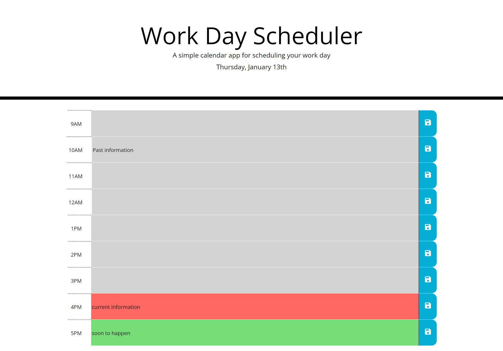

# work_day_scheduler_TJ

## About

This projects was about creating a working day planner, incorporating Moment and localStorage.

The page contains a header, with the day, month and date underneath.

The body of the page contains rows of colour (which update grey, red and green based on if the hour has past, present or in the future), with a time on the left, an input in the middle, and a save button on the right.

At the bottom of the page is a button that says clear all, upon clicking it will delete all the saved items and reset the page.

Upon clicking the save button, the content of the row will be saved to localStorage to be viewed at a later time.

If the day is different, the page will reset, and if the hour changes while viewing, so will the colours.

## Challenges Faced

In order to make this website work, i had to use Arrays and attributes in a different way, so as to not write even more code.

The other challenge I faced, was with organising the rows in a correct mannor, I should of had the input changing colour, instead of its background.

## The Final Product

live application available at [work_day_scheduler_TJ](https://tomjia98.github.io/work_day_scheduler_TJ/)

## Contact

for more information, feel free to contact me at Tomjia1998@gmail.com
